# System Application 
 
##### Created By Rachell Cordero

This is a Python-based application built using the Flask framework where users may sign in with a username and password and each user can be given a role with corresponding permissions.


## Getting Started

These instructions will get you a local copy of the project up and running for development and testing. For information on how to install the project on a live system, see deployment.

### REQUIREMENTS

Modules and libraries required to run the system:

```
Flask, request, jsonify, send_from_directory,render_template,redirect, url_for,  pyodbc
```

## How To Install

Please follow the following steps to be able to run the system in your machine. 

1. Open command prompt and make a flask directory. In your command window type:
```
mkdir flask-test
```
2. Go to the directory by typing the following in your command window:
```
cd flask-test
```
3. Install a virtual environment and run it. 

```
virtualenv .
```
4. From the directory go to Scripts and look for activate and run by typing activate to the cmd. 
```
Scripts\activate
```
5. Using command window, install flask in the virtual environment.
```
Python -m pip install Flask
```
6. Install the PYODBCS module. In the command window type,

```
pip install pyodbc
```
7. Run flask using:
```
flask run
```


Installation is successful when this message is shown:
```
 * Environment: production
   WARNING: This is a development server. Do not use it in a production deployment.
   Use a production WSGI server instead.
 * Debug mode: off
 * Running on http://127.0.0.1:5000 (Press CTRL+C to quit)
 ```


## USAGE

1. To open the system, type the http address shown in the last line of the cmd window. Users are first taken to the login page when the application loads. He can log in using his registered username and password. 
<p align="center">
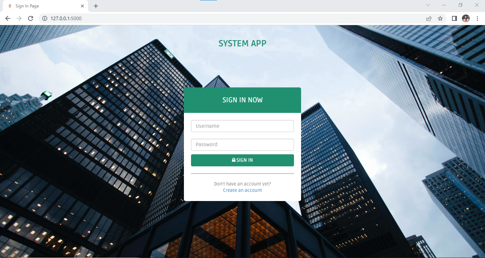
</p>

2. However, if a user doesn't already have an account, he can create one by clicking "Create an Account," which will take him to the sign-up page. A user needs to provide a username, password, his first and last name and an email address to be able to sign up. upon signing up, he will be directed to the main page of the application. 
<p align="center">
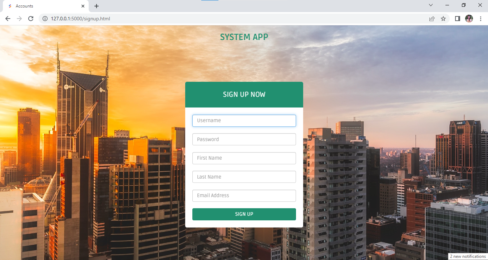
</p>

3. There are three pages available which can be selected in the side dashboard.  The first one is the users page that displays all user information. A user can be given a specific role on this page using Assign button. A user may be removed as well using Delete User button.
<p align="center">
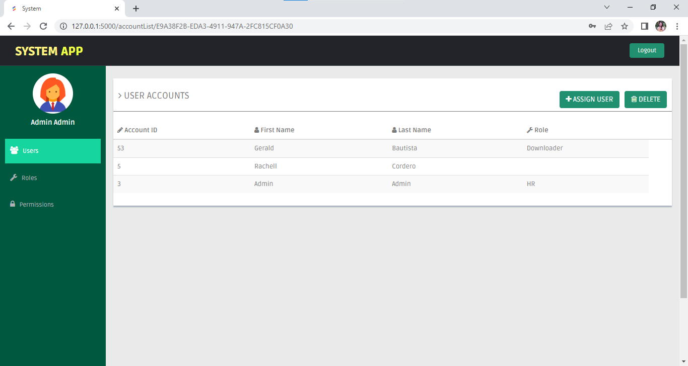
</p>

4. On the roles page, the available roles as well as their corresponding permissions can be seen. New roles can be created using the Add button and specific permissions for the role will be can be assigned as well. When additional permissions are created in the permissions page, it will also reflect in the roles page.
<p align="center">
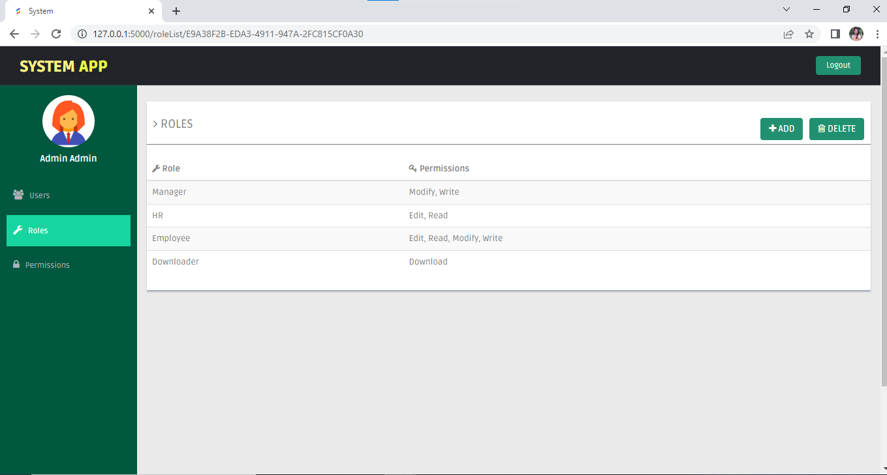
</p>
5. Lastly, the permissions page contains all the available permissions that can be assigned to a user. Additional permissions can be created using the add button and existing permissions can be deleted as well. Once a permission has been deleted, it will no longer reflect on the roles pages.  
<p align="center">
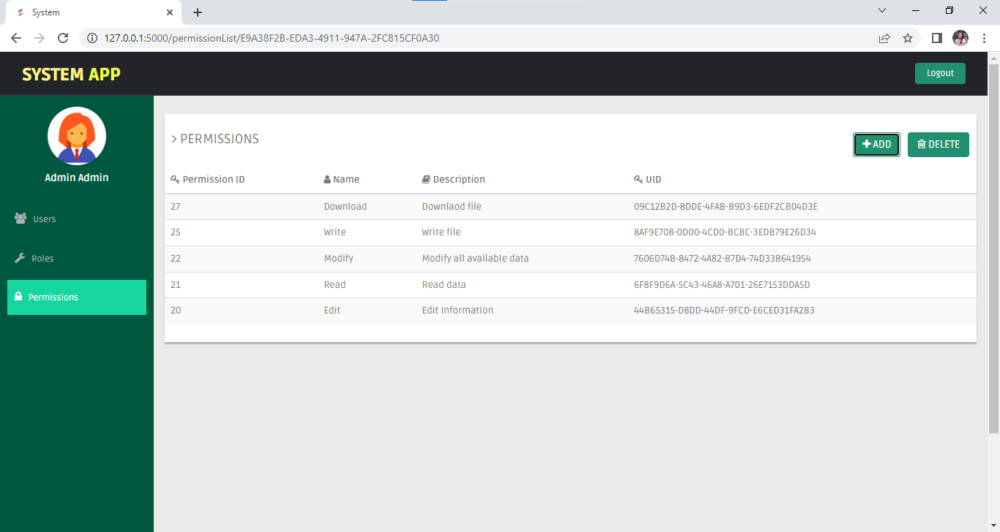
</p>
6. To make the application look cleaner, the add and remove buttons are first hidden. Modal forms are then called to specify the exact roles and permissions that will be created. The delete buttons for each row will appear when the delete button is pushed.
<p align="center">
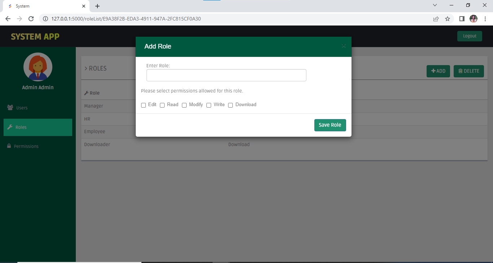 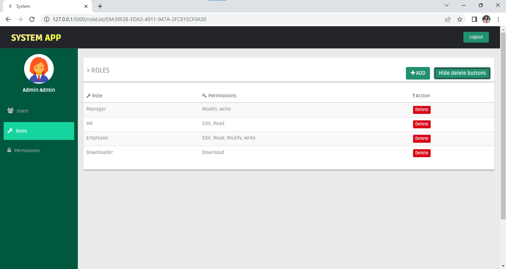
</p>
7. There are three databases connected to the application, an account table containing the information of the users such as their user names, password, full name and email. A second table is created containing the roles and assigned permission to thes roles. Last table contains the permissions available to be assigned to a user. 


## ER Diagram
<p align="center">
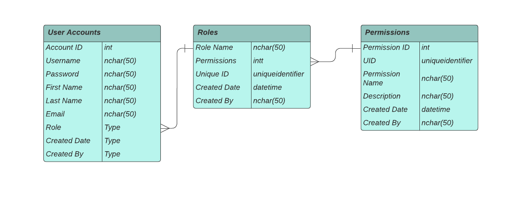
</p>


## Unit testing of API services
Unit testing for the sign up page: 
<p align="center">
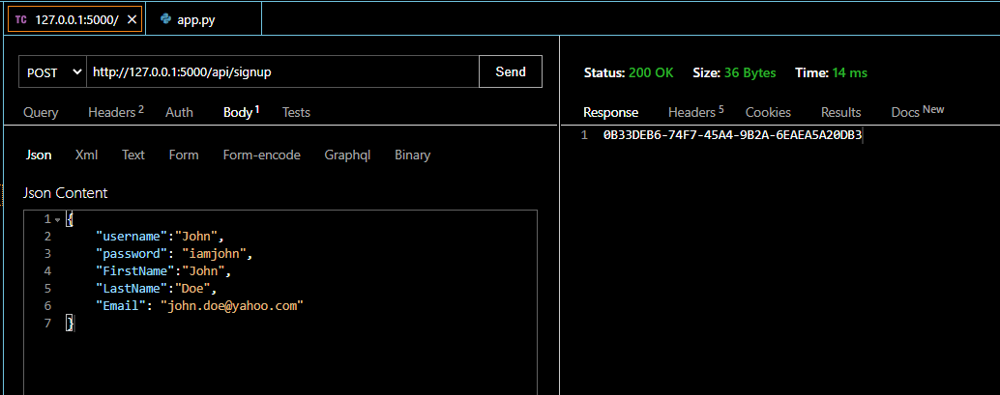
</p>

Unit testing for the users page which consists of requesting roles and permissions using the users's unique ID and assigning a role to a user. 
<p align="center">
   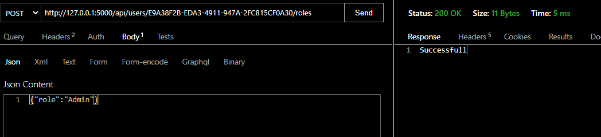 
   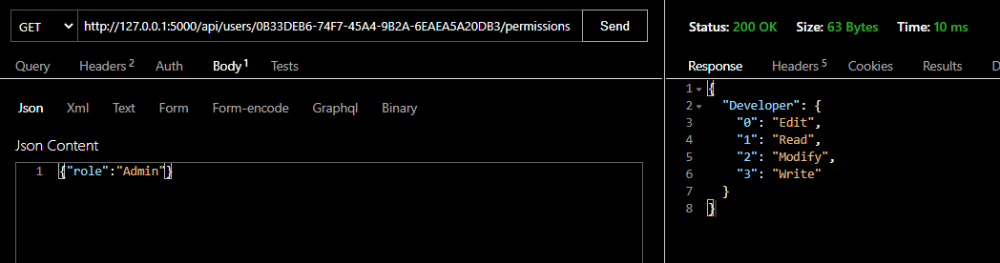 
   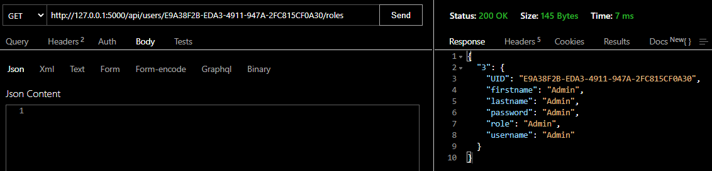
</p>

Unit testing for the roles page which includes reuesting for the list of available roles and creating new roles. 
<p align="center">
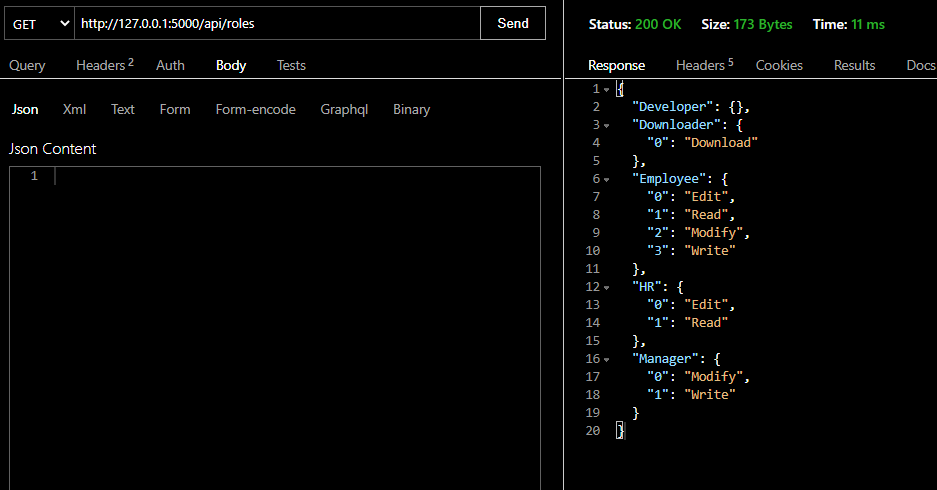 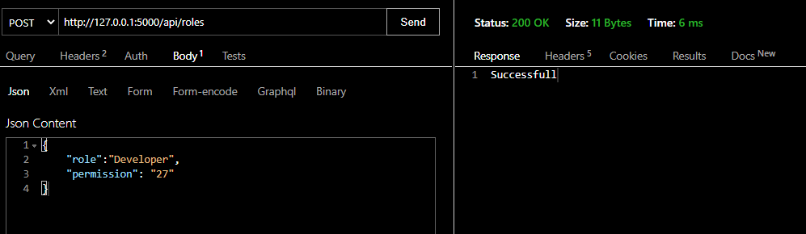
</p>

Unit testing for requesting available permission to a certain role and assigning permissions to a new role. 
<p align="center">
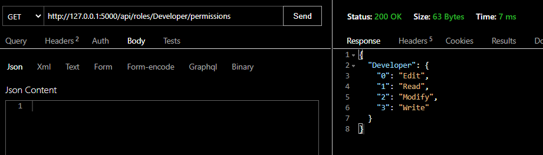 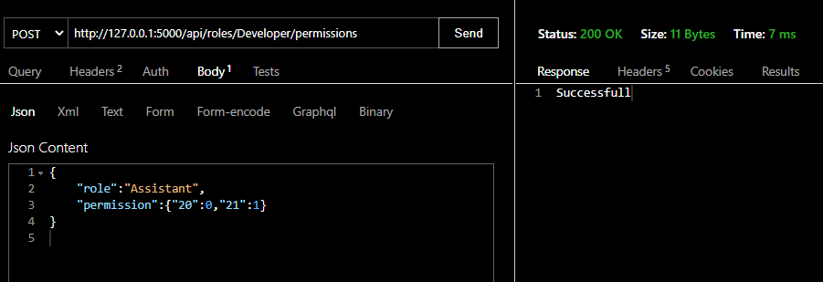
</p>

Unit testing for creating new permissions and requesting for available permissions. 
<p align="center">
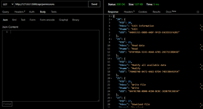 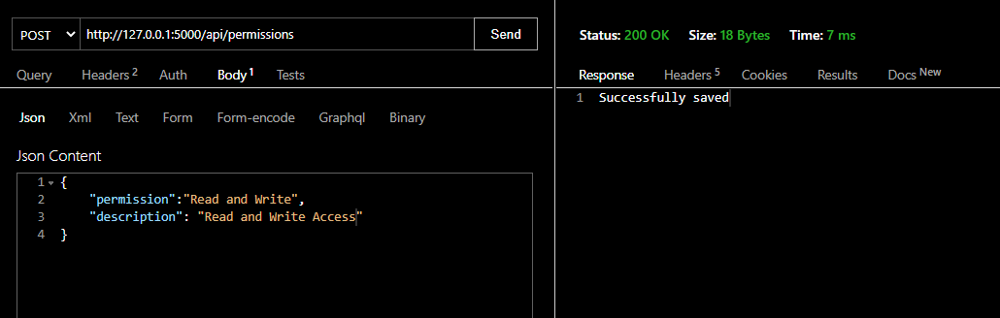
</p>
